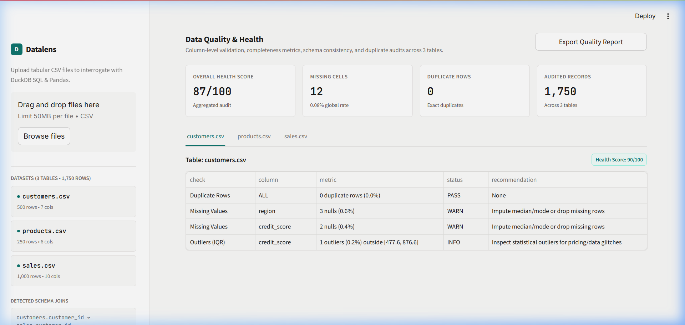
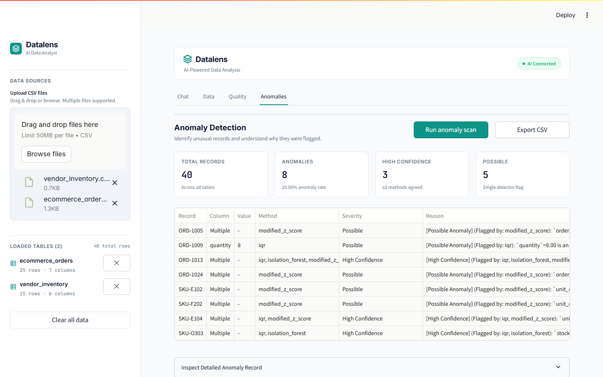

# 📊 DataLens — AI-Powered Data Analyst

> Turn your data into decisions.

DataLens is an AI-powered data analysis application that allows users to upload one or more CSV files and interact with their data using natural language.

The application combines **Streamlit, Python, Pandas, DuckDB, and Groq AI** to transform raw CSV data into analytical insights, SQL queries, visualizations, anomaly reports, and data-quality information.

---

## 🚀 Live Application

🌐 **Live Demo:**

https://ai-data-analyst-akshay.streamlit.app

---

## 💻 GitHub Repository

https://github.com/akshayh0/AI-Data-Analyst

---

# 🎯 Problem Statement

Traditional data analysis often requires users to understand SQL, Python, spreadsheets, or specialized business-intelligence tools.

Non-technical users may find it difficult to:

- Explore large datasets
- Write SQL queries
- Identify trends
- Detect anomalies
- Understand data quality
- Generate meaningful business insights
- Work with multiple related datasets

DataLens addresses this problem by providing a natural-language interface for interacting with structured CSV data.

Users can upload their datasets and ask questions in plain English while the application performs the required analytical operations.

---

# 💡 Project Objectives

The main objectives of DataLens are to:

- Provide an easy-to-use AI-powered data analysis platform
- Support multiple CSV file uploads
- Automatically inspect uploaded datasets
- Understand natural-language questions
- Generate analytical SQL when appropriate
- Perform Python/Pandas-based analysis when appropriate
- Generate useful business insights
- Create data visualizations
- Detect anomalies
- Analyze data quality
- Identify relationships between datasets
- Maintain conversational context
- Provide a professional analytics dashboard

---

# ✨ Key Features

## 📂 1. Multiple CSV Upload

Users can upload one or more CSV files through the Streamlit interface.

For every uploaded dataset, the application can display:

- Dataset name
- Number of rows
- Number of columns
- Data preview
- Column information
- Dataset schema

---

## 🤖 2. AI-Powered Natural Language Analysis

Users can ask questions about their uploaded data without manually writing SQL or Python.

Example questions:

```text
Show total revenue
````

```text
Which product generated the highest revenue?
```

```text
Who are the top 10 customers?
```

```text
Show monthly revenue trends
```

```text
Detect anomalies in the sales data
```

The AI analyzes the available datasets and determines the appropriate analytical approach.

---

## 🧠 3. Groq AI Integration

DataLens integrates with the Groq API for AI-powered data analysis.

The primary configured model is:

```text
openai/gpt-oss-120b
```

A fallback model can be configured for temporary availability or rate-limit situations.

API credentials are stored securely using environment variables and deployment secrets.

The actual API key is never included in the source code or README.

---


## 🐼 4. Pandas Data Analysis

Pandas is used for dataframe processing and analytical operations.

It supports:

* Data inspection
* Data transformation
* Statistical calculations
* Missing-value analysis
* Duplicate detection
* Data preparation
* Visualization preparation

---

## 📈 5. Data Visualization

DataLens can generate visual representations of analytical results.

Depending on the question and available data, visualizations can include:

* Bar charts
* Line charts
* Pie charts
* Scatter plots
* Trend charts
* Comparative charts

Example question:

```text
Show monthly revenue trends as a line chart.
```

---

## 🚨 6. Anomaly Detection

DataLens provides anomaly analysis to identify unusual observations in the uploaded data.

Anomaly information can include:

* Dataset/table
* Row or record identifier
* Column
* Detected value
* Detection method
* Severity or confidence
* Explanation

The application also explains why an observation was flagged as an anomaly.

---

## 🧪 7. Data Quality Analysis

The Data Quality section helps users understand the quality and structure of their datasets.

It can provide information such as:

* Total rows
* Total columns
* Missing values
* Duplicate records
* Data types
* Column-level statistics
* Quality warnings

---

## 🔗 8. Automatic Dataset Relationships

When multiple datasets contain related identifiers, DataLens can identify potential relationships.

For example:

```text
customers.customer_id
        ↓
sales.customer_id

products.product_id
        ↓
sales.product_id
```

This allows users to perform analysis across related datasets.

---

## 💬 9. Conversational Data Analysis

DataLens supports conversational interaction with the loaded data.

Example:

```text
User:
Which region generated the highest revenue?

AI:
The North region generated the highest revenue.

User:
Show that as a bar chart.
```

The application can use the current conversation context to continue the analysis.

---

## 🔍 10. SQL and Analytical Reasoning

When appropriate, DataLens can generate analytical SQL and use the available data to produce the final answer.

The application is designed to distinguish between:

* SQL-based analysis
* Python/Pandas analysis
* Statistical calculations
* AI-generated explanations

This provides more transparent analytical results.

---

# 🏗️ System Architecture

```text
                         ┌─────────────────────┐
                         │        USER         │
                         │                     │
                         │ Upload CSV / Ask Qs │
                         └──────────┬──────────┘
                                    │
                                    ▼
                         ┌─────────────────────┐
                         │    STREAMLIT UI     │
                         │      DataLens       │
                         └──────────┬──────────┘
                                    │
                ┌───────────────────┼───────────────────┐
                │                   │                   │
                ▼                   ▼                   ▼
        ┌──────────────┐    ┌──────────────┐    ┌──────────────┐
        │ CSV Upload   │    │ Data Quality │    │  Anomalies   │
        └──────┬───────┘    └──────────────┘    └──────────────┘
               │
               ▼
        ┌──────────────────┐
        │ Pandas Processing│
        └────────┬─────────┘
                 │
                 ▼
        ┌──────────────────┐
        │      DuckDB      │
        │   SQL Analytics  │
        └────────┬─────────┘
                 │
                 ▼
        ┌──────────────────┐
        │     Groq AI      │
        │ Query Planning & │
        │ Interpretation   │
        └────────┬─────────┘
                 │
                 ▼
        ┌────────────────────────┐
        │    Analysis Results    │
        │                        │
        │ • Answers              │
        │ • Insights             │
        │ • SQL                  │
        │ • Charts               │
        │ • Statistics           │
        │ • Anomalies            │
        └────────────────────────┘
```

---

# 🛠️ Technologies Used

| Technology                | Purpose                      |
| ------------------------- | ---------------------------- |
| Python                    | Core programming language    |
| Streamlit                 | Web application framework    |
| Pandas                    | Data processing and analysis |
| DuckDB                    | Analytical SQL engine        |
| Groq API                  | AI-powered analysis          |
| SQL                       | Analytical querying          |
| Plotly / Charts           | Data visualization           |
| Git                       | Version control              |
| GitHub                    | Source-code hosting          |
| Streamlit Community Cloud | Application deployment       |
| Docker                    | Containerization             |

---

# 📁 Project Structure

```text
AI-Data-Analyst/
│
├── app/
│   ├── main.py
│   └── ui/
│       ├── sidebar.py
│       ├── chat.py
│       ├── answer_card.py
│       ├── data_tab.py
│       ├── anomalies_tab.py
│       ├── quality_tab.py
│       ├── styles.css
│       └── theme.py
│
├── src/
│   └── ...
│
├── scripts/
│   └── ...
│
├── docs/
│   ├── architecture.png
│   └── screenshots/
│       ├── dashboard.png
│       ├── analysis.png
│       ├── quality.png
│       └── anomalies.png
│
├── .env.example
├── .gitignore
├── requirements.txt
├── Dockerfile
└── README.md
```

---

# ⚙️ Local Installation

## 1. Clone the Repository

```bash
git clone https://github.com/akshayh0/AI-Data-Analyst.git
```

Move into the project directory:

```bash
cd AI-Data-Analyst
```

---

## 2. Create a Virtual Environment

### Windows

```powershell
python -m venv venv
```

Activate the environment:

```powershell
venv\Scripts\activate
```

### Linux / macOS

```bash
python3 -m venv venv
```

Activate:

```bash
source venv/bin/activate
```

---

## 3. Install Dependencies

```bash
pip install -r requirements.txt
```

---

# 🔐 Environment Variables

Create a `.env` file in the project root.

```env
GROQ_API_KEY=your_groq_api_key_here
GROQ_MODEL=openai/gpt-oss-120b
```

### Important

Never commit the real Groq API key to GitHub.

The repository contains `.env.example` as a safe configuration template.

---

# ▶️ Run the Application

Start the Streamlit application with:

```bash
python -m streamlit run app/main.py
```

The application will normally be available at:

```text
http://localhost:8501
```

---

# 📊 Application Workflow

```text
1. Open DataLens
        ↓
2. Upload one or more CSV files
        ↓
3. Application inspects datasets
        ↓
4. Tables are loaded for analysis
        ↓
5. Schema and relationships are detected
        ↓
6. User asks a question in natural language
        ↓
7. AI determines the appropriate analysis
        ↓
8. SQL / Pandas analysis is performed
        ↓
9. Results are generated
        ↓
10. Insights and visualizations are displayed
```

---

# 🧑‍💻 How to Use

## Step 1 — Upload Data

Use the CSV upload section to upload one or more datasets.

For example:

```text
customers.csv
products.csv
sales.csv
```

---

## Step 2 — Review Your Data

After uploading, review:

* Dataset names
* Row counts
* Column counts
* Data previews
* Schema
* Detected relationships

---

## Step 3 — Ask a Question

Example:

```text
Show total revenue.
```

---

## Step 4 — Review AI Analysis

The application processes the question and returns the analytical result.

The result may contain:

* Final answer
* Key insights
* SQL
* Charts
* Supporting information

---

## Step 5 — Explore Data Quality

Open the **Quality** section to inspect:

* Missing values
* Duplicate rows
* Data types
* Column statistics
* Quality warnings

---

## Step 6 — Detect Anomalies

Open the **Anomalies** section to identify unusual records and understand why they were flagged.

---

# 🧪 Example Questions

Users can ask questions such as:

```text
Show total revenue.
```

```text
Which product generated the highest revenue?
```

```text
Who are the top 10 customers by spending?
```

```text
What is the average order value?
```

```text
Show monthly revenue trends.
```

```text
Which region has the highest sales?
```

```text
Find anomalies in the sales data.
```

```text
Summarize the most important business insights.
```

```text
Which products are underperforming?
```

---

# 📦 Sample Datasets

The application can be demonstrated using related CSV datasets.

Example:

| Dataset       |  Rows | Columns |
| ------------- | ----: | ------: |
| customers.csv |   500 |       7 |
| products.csv  |   250 |       6 |
| sales.csv     | 1,000 |      10 |

Example relationships:

```text
customers.customer_id → sales.customer_id

products.product_id → sales.product_id
```

These datasets demonstrate multi-table analytical workflows.

---

# 🐳 Docker Support

The project includes Docker support for containerized execution.

## Build Docker Image

```bash
docker build -t ai-data-analyst .
```

## Run Container

```bash
docker run -p 8501:8501 ai-data-analyst
```

Open the application:

```text
http://localhost:8501
```

Make sure the required environment variables or secrets are supplied securely.

---

# ☁️ Deployment

DataLens is deployed using Streamlit Community Cloud.

### Deployment Configuration

```text
Repository:
akshayh0/AI-Data-Analyst

Branch:
main

Main file:
app/main.py
```

### Live Application

[https://ai-data-analyst-akshay.streamlit.app](https://ai-data-analyst-akshay.streamlit.app)

---

# 🔒 Security

Sensitive credentials are not stored directly in the source code.

The application uses environment variables and deployment secrets.

Example:

```env
GROQ_API_KEY=your_groq_api_key_here
```

The `.env` file should remain local and should not be committed.

For Streamlit Cloud deployment, secrets should be configured through the Streamlit Secrets management system.

---

# ⚠️ Assumptions and Implementation Notes

* CSV files are the primary supported input format.
* Uploaded datasets should contain structured tabular data.
* Analytical questions depend on the available dataset schema.
* Relationships between datasets depend on matching identifiers or compatible columns.
* AI-generated analysis depends on the configured Groq API.
* Large datasets may require additional memory and processing resources.
* Generated insights should be reviewed before being used for important business decisions.
* The application performs analysis based on the data available in the current session.

---

# 🚧 Known Limitations

Currently:

* CSV is the primary supported input format.
* Very large datasets may require additional optimization.
* AI analysis depends on Groq API availability and limits.
* Complex questions may require clear relationships between datasets.
* AI-generated insights should be validated for critical business decisions.
* Persistent user accounts and long-term analysis history are not currently the primary focus.

---

# 🔮 Future Enhancements

Future versions could include:

* Excel file support
* PostgreSQL integration
* MySQL integration
* Direct database connections
* Advanced anomaly detection
* Automated report generation
* PDF report export
* Excel report export
* Custom dashboard creation
* User authentication
* Persistent analysis history
* Scheduled reports
* More visualization types
* Cloud database integration
* Advanced AI data-agent capabilities

---

# 📸 Screenshots

## Main Dashboard


---

## AI Analysis


---

## Data Quality



---

## Anomaly Detection



---

# 🏛️ Architecture Diagram

The project architecture diagram is available at:

```text
docs/architecture.png
```

---

# 🎥 Demo Video

A short **10–30 second demonstration video** showcases the application's main workflow:

1. Opening the DataLens application
2. Uploading CSV datasets
3. Asking a natural-language question
4. Receiving AI-powered analysis
5. Viewing analytical results
6. Exploring data quality/anomaly features

### Demo Video

Add the final demo video link here:

```text
[ADD YOUR DEMO VIDEO LINK HERE]
```

---

# 📋 Internship Deliverables

| Requirement                    | Status |
| ------------------------------ | ------ |
| Complete source code           | ✅      |
| README with setup instructions | ✅      |
| Architecture diagram           | ✅      |
| Screenshots                    | ✅      |
| Live application               | ✅      |
| Docker support                 | ✅      |
| Sample datasets                | ✅      |
| Implementation notes           | ✅      |
| Demo video                     | 🔄     |

---

# 🎯 Project Highlights

DataLens demonstrates practical implementation of:

* Generative AI
* Natural-language data analysis
* SQL generation
* Python/Pandas analytics
* DuckDB
* Data visualization
* Anomaly detection
* Data-quality analysis
* Multi-table analysis
* Streamlit application development
* API integration
* Cloud deployment
* Docker containerization

---

# 👨‍💻 Author

## Akshay H

Artificial Intelligence & Machine Learning

GitHub:

[https://github.com/akshayh0](https://github.com/akshayh0)

---

# 🌐 Project Links

### Live Application

[https://ai-data-analyst-akshay.streamlit.app](https://ai-data-analyst-akshay.streamlit.app)

### GitHub Repository

[https://github.com/akshayh0/AI-Data-Analyst](https://github.com/akshayh0/AI-Data-Analyst)

---

# 📄 License

This project is intended for educational, internship evaluation, demonstration, and portfolio purposes.

```
